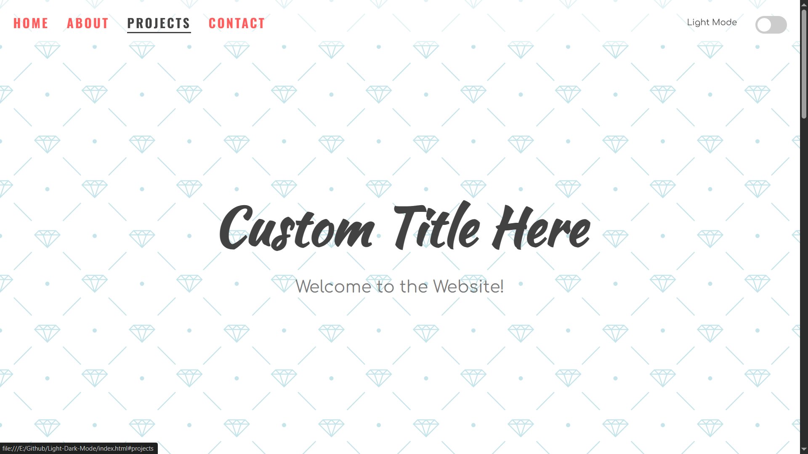
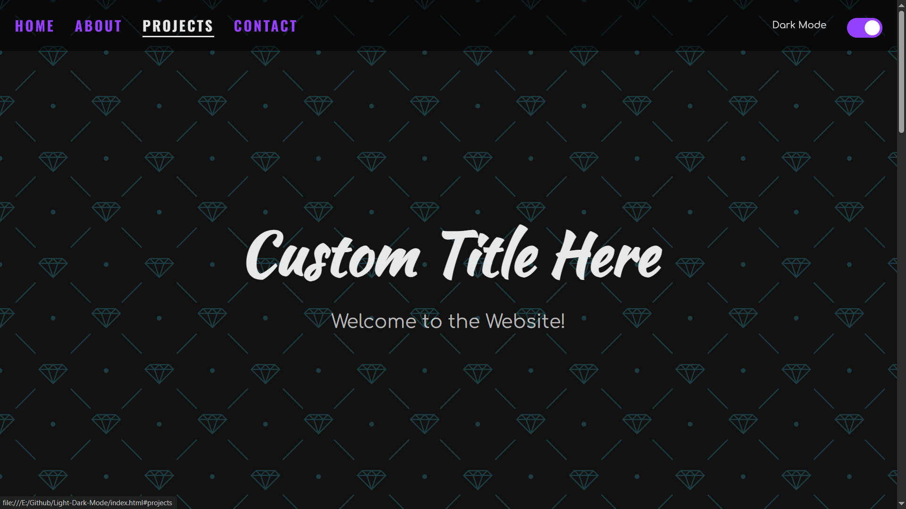

# Light & Dark Mode 🌗

This is a simple web project that implements a **Light & Dark Mode** switch using HTML, CSS, and JavaScript.




## Resources:
- Background-image: https://heropatterns.com/
- Toggle-switch: https://www.w3schools.com/howto/howto_css_switch.asp

## 🌟 Features

- 🔄 **Toggle between Light & Dark mode**  
- 🎨 **Smooth theme transition**  
- 💾 **Theme preference saved in local storage**  
- 📱 **Fully responsive design**  

## 🚀 How to Use

1. Clone this repository:  
   ```sh
   git clone https://github.com/Khairul25556/Light-Dark-Mode.git

